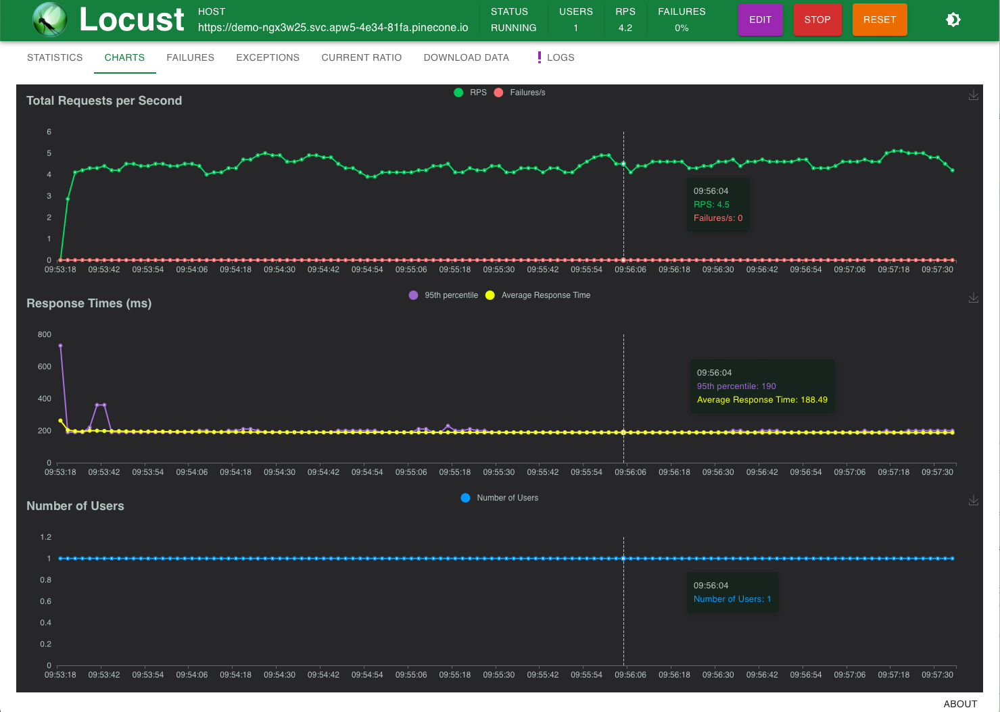

<h1 align="center"> </h1>

# Locust load testing for Pinecone

**Locust-pinecone** is a load-testing tool for [Pinecone](https://www.pinecone.io), built on the [Locust](https://locust.io) load-testing framework. Its aim is to make it easy for users to simulate realistic load against a Pinecone Index, to aid in workload sizing.

It can:
* Simulate an arbitrary number of clients issuing different kinds of requests against a Pinecone Index.
* Measure the throughput & latency of requests from the client's point of view.
* Populate the Index with a user-specified dataset before generating load, or operate against existing vectors.
* Be run interactively via Locust's Web-based UI or via the command-line.

locust-pinecone is highly scalable - it can generate from 1 to 10,000 Queries per second (QPS) by making use of multiple client processes to drive the load.

## Quickstart

### Install (Linux / macOS)

1. Clone this repo:
   ```shell
   git clone https://github.com/pinecone-io/locust-pinecone.git
   ```

2. Use Poetry to install dependancies
   ```shell
   cd locust-pinecone
   pip3 install poetry
   poetry install
   ```

3. Activate environment containing dependancies
   ```shell
   poetry shell
   ```

4. Prepare the environment variables and start Locust:
   ```shell
   ./locust.sh
   ```

### First-time Setup

This assumes you already have a Pinecone account and an index defined.

The `locust.sh` script starts with a setup shell tool which helps you configure the app.
You should provide this script the following:

1. **Pinecone API key** such as `fb1b20bc-d702-4248-bb72-1fcd50f03616` This can be found in your [Pinecone console](https://app.pinecone.io) under Projects.
2. **Index Host** such as <https://squad-p2-2a849c7.svc.us-east-1-aws.pinecone.io> This can be found in the index section of your [Pinecone console](https://app.pinecone.io).

_Note_: once you configure your app, the API key and Index Host will be written to a .env file in the current directory,
and will be used automatically next time you run the script. You can edit this as needed if your API key or Index Host change.

After writing the .env file, the script will then start the Locust Web UI which can be accessed following the instructions in the shell - default https://localhost:8089

The next time you run `locust.sh`, it will load the previously saved environment variables and start Locust immediately.

### Generate load using Web UI

Locust provides a WebUI to configure the workload and monitor the results once started. On opening, you will be presented with the 'Start new load test' dialog, which allows the Number of Users, User Ramp up, and Host to be specified.


Click on "Start Swarm" to begin the load test. The UI switches to show details of the load test, initially showing a table summarising all requests so far, including count, error rate, and various latency statistics. Switching to the _Charts_ tab shows graphs of the Requests per Second, and Latency of those requests:



The workload can be changed dynamically by selecting "Edit" in the menubar and adjusting the number of users.

See Locust's own [Quickstart](https://docs.locust.io/en/stable/quickstart.html) guide for full details on the Web UI.

### Command-line usage

Locust-pinecone can also be used in a non-interactive way via the command-line, for scripting specific workloads or part of a larger pipeline. This is done by calling locust with the `--headless` option; and including the manditory `--host=` option:
```shell
locust --host=https://demo-ngx3w25.svc.apw5-4e34-81fa.pinecone.io --headless
```

Locust will print periodic statistics on the workload as it runs.  By default, it will generate load forever; to terminate press `Ctrl-C` where it will print metrics on all requests issued:
```shell
Type     Name                   # reqs      # fails |    Avg     Min     Max    Med |   req/s  failures/s
--------|---------------------|-------|-------------|-------|-------|-------|-------|--------|-----------
Pine gRPC  Fetch                    36     0(0.00%) |    183     179     231    180 |    0.98        0.00
Pine gRPC  Vector (Query only)      26     0(0.00%) |    197     186     308    190 |    0.70        0.00
Pine gRPC  Vector + Metadata        41     0(0.00%) |    194     185     284    190 |    1.11        0.00
--------|---------------------|-------|-------------|-------|-------|-------|-------|--------|-----------
         Aggregated                163     0(0.00%) |    194     179     737    190 |    4.42        0.00

Response time percentiles (approximated)
Type     Name                      50%    66%    75%    80%    90%    95%    98%    99%  99.9% 99.99%   100% # reqs
--------|--------------------|--------|------|------|------|------|------|------|------|------|------|------|------
Pine gRPC Fetch                    180    180    180    180    180    210    230    230    230    230    230     36
Pine gRPC Vector (Query only)      190    190    190    190    200    250    310    310    310    310    310     26
Pine gRPC Vector + Metadata        190    190    190    200    200    210    280    280    280    280    280     41
--------|--------------------|--------|------|------|------|------|------|------|------|------|------|------|------
         Aggregated                190    190    190    190    200    210    250    310    740    740    740    163
```


## Customising the workload

Locust-pinecone provides a wide range of options to customise the workload generated, along with Pinecone-specific options. See the output of `locust --help` and Locust's own [Command-line Options](https://docs.locust.io/en/stable/configuration.html) documentation for full details, but some of the more common options are listed below:

### Fixed runtime

Run non-interactively for a fixed amount of time by specifying ``--run-time=TIME``, where time as a count and unit, e.g `60s`, `5m`, `1h`... Requires `--headless`:
```shell
$ locust --host=<HOST> --headless --run-time=60s
```

### Using pre-defined Datasets

By default, locust-pinecone will generate random query vectors to issue requests against the specified index. It can also use a pre-defined Dataset to provide both the documents to index, and the queries to issue.

To use a pre-defined dataset, specify the `--pinecone-dataset=<DATASET>` with the name of the [Pinecone Public Dataset](https://docs.pinecone.io/docs/using-public-datasets) to use.  Specifying `list` as the name of the dataset will list all available datasets:
```shell
$ locust --pinecone-dataset=list
Fetching list of available datasets for --pinecone-dataset...
Name                                            Documents    Queries    Dimension
--------------------------------------------  -----------  ---------  -----------
ANN_DEEP1B_d96_angular                            9990000      10000           96
ANN_Fashion-MNIST_d784_euclidean                    60000      10000          784
ANN_GIST_d960_euclidean                           1000000       1000          960
ANN_GloVe_d100_angular                            1183514      10000          100
quora_all-MiniLM-L6-bm25-100K                      100000      15000          384
...
```

Passing one of the available names via `--pinecone-dataset=` will download that dataset (caching locally in `.dataset_cache/`), upsert the documents into the specified index and generate queries.

For example, to load the `quora_all-MiniLM-L6-bm25-100K` dataset consisting of 100,000 vectors, then perform requests for 60s using the pre-defined 15,000 query vectors:

```shell
$ locust --host=<HOST> --headless --pinecone-dataset=quora_all-MiniLM-L6-bm25-100K --run-time=60s
[2024-02-28 11:28:59,977] localhost/INFO/locust.main: Starting web interface at http://0.0.0.0:8089
[2024-02-28 11:28:59,981] localhost/INFO/root: Loading Dataset quora_all-MiniLM-L6-bm25-100K into memory for Worker 66062...
Downloading datset: 100%|███████████████████████████████████████████████████████| 200M/200M [00:34<00:00, 5.75MBytes/s]
[2024-02-28 11:29:36,020] localhost/INFO/root: Populating index <HOST> with 100000 vectors from dataset 'quora_all-MiniLM-L6-bm25-100K'
Populating index: 100%|█████████████████████████████████████████████████| 100000/100000 [02:36<00:00, 639.83 vectors/s]
[2024-02-28 11:51:15,757] localhost/INFO/locust.main: Run time limit set to 60 seconds
[2024-02-28 11:51:15,758] localhost/INFO/locust.main: Starting Locust 2.23.1
...
Response time percentiles (approximated)
Type     Name                            50%    66%    75%    80%    90%    95%    98%    99%  99.9% 99.99%   100% # reqs
--------|--------------------------|--------|------|------|------|------|------|------|------|------|------|------|------
Pine gRPC Fetch                          240    270    300    310    320    330    360    570    570    570    570     62
Pine gRPC Vector (Query only)            190    190    190    200    210    260    710    710    710    710    710     44
Pine gRPC Vector + Metadata              180    180    180    180    200    220    340    340    340    340    340     35
--------|--------------------------|--------|------|------|------|------|------|------|------|------|------|------|------
         Aggregated                      190    200    220    230    300    310    330    570    770    770    770    273
```

Population can be used in either WebUI or headless mode.

When a dataset is specified the index will be populated with it if the existing Index vector count differs from the document count. This behaviour can be overridden using the `--pinecone-populate-index` option, which takes one of three values:

* `always` : Always populate from dataset.
* `never`: Never populate from dataset.
* `if-count-mismatch` (default): Populate if the number of items in the index differs from the number of items in th dataset, otherwise skip population

### Measuring Recall

In additional to latency, the [Recall](https://www.pinecone.io/learn/offline-evaluation/#Recall@K) of Query requests
can also be measured and reported via the `--pinecone-recall` option. This requires a Dataset is used (`--pinecone-dataset=`) which includes a _queries_ set - so there is an exact-NN to evaluate the Query results against.

> [!TIP]
> `--pinecone-datasets=list` can be used examine which Datasets have a Queries set. For example, the `ANN_LastFM_d64_angular` dataset meets these requirements:
>  ```shell
>   $ locust --pinecone-dataset=list
>   ...
>   Name                                            Documents    Queries    Dimension
>   --------------------------------------------  -----------  ---------  -----------
>   ANN_DEEP1B_d96_angular                            9990000      10000           96
>   ANN_Fashion-MNIST_d784_euclidean                    60000      10000          784
>   ANN_LastFM_d64_angular                             292385      50000           65
>   ...
>   ```

Locust doesn't currently have a way to add additional metrics to the statistics reported, so Recall values are reported instead of latencies; expressing the Recall as a value between 0 and 100 (Locust doesn't support fractional latency values). 

Example of measuring Recall for "ANN_LastFM_d64_angular" dataset for 10s runtime:

```shell
$ locust --host=<HOST> --headless --pinecone-dataset=ANN_LastFM_d64_angular --pinecone-recall --tag query --run-time=10s
...
Type           Name                        # reqs      # fails |    Avg     Min     Max    Med |   req/s  failures/s
--------------|----------------------|-------|-------------|-------|-------|-------|-------|--------|-----------
Pinecone gRPC  Vector (Query only)       1117     0(0.00%) |     96      10     100    100 |   18.59        0.00
--------------|----------------------|-------|-------------|-------|-------|-------|-------|--------|-----------
               Aggregated                1117     0(0.00%) |     96      10     100    100 |   18.59        0.00

Response time percentiles (approximated)
Type           Name                        50%    66%    75%    80%    90%    95%    98%    99%  99.9% 99.99%   100% # reqs
--------------|----------------------|--------|------|------|------|------|------|------|------|------|------|------|------
Pinecone gRPC  Vector (Query only)         100    100    100    100    100    100    100    100    100    100    100   1117
--------------|----------------------|--------|------|------|------|------|------|------|------|------|------|------|------
               Aggregated                  100    100    100    100    100    100    100    100    100    100    100   1117
```

## Additional performance notes and optimizations (all environments)

1. While this can run locally on a machine in your home network, you **will** experience additional latencies depending on your location. It is recommended to use this on a VM in the cloud, preferably on the same cloud provider (GCP,AWS) and in the same region to minimize the latency. This will give a more accurate picture of how your infrastructure performs with Pinecone when you go to production.
2. The test cases included in the locust.py file are designed to generate random queries along with random categories. It also exercises several endpoints such as query, fetch, delete, and demonstrates metadata filtering. You should consider your use case and adjust these tests accordingly to reflect the real world scenarios you expect to encounter.
3. There is a lot of functionality built into Locust and we encourage you to [review the documentation](https://docs.locust.io/en/stable/index.html) and make use of all of the functionality it offers.


## Developing locust-pinecone

PRs are welcome!

The project defines a set of [pre-commit hooks](https://pre-commit.com), which should be enabled to check commits pass all checks. After installing project dependencies (via `poetry install`), run:

```shell
pre-commit install
```
