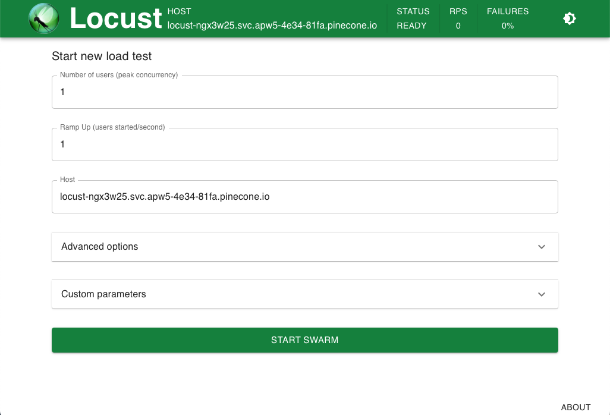

<h1 align="center"> </h1>

# Locust load testing for Pinecone

Run load tests against your Pinecone index. This repository assumes you already have a Pinecone account, an index, and data has already been upserted. Learn more about how to write a Locust file [here](https://docs.locust.io/en/stable/writing-a-locustfile.html).

## Installation on Macbook Pro M1

1. clone this repo and cd to 'locust-pinecone'  

```shell
git clone https://github.com/pinecone-io/locust-pinecone.git
```

2. It is highly recommended to create a virtual environment before running the requirements portion of this README.

```shell
cd locust-pinecone
python3 -m venv .venv
source .venv/bin/activate
```

3. Install project requirements:

```shell
pip install -r requirements.txt
```

Prepare the environment variables and start Locust

4. Run the following bash script:

```shell
./locust.sh
```

This script will start with a setup shell tool which helps you configure the app.
You should provide this script the following:

1. API key Pinecone such as fb1b20bc-d702-4248-bb72-1fcd50f03616 (Your API Key is in your Pinecone console under Projects)
2. Full path to your index such as <https://squad-p2-2a849c7.svc.us-east-1-aws.pinecone.io> (Your API Host is found under the index section of your Pinecone console)

Note: once you configure your app, the API key and API Host will be written to a .env file in the repo,
and will be used automatically next time you run the script. You can edit this as needed if your API key or API host change in the future.

After writing the .env file, the script will then start Locust which can be accessed following the instructions in the shell

```shell
pineconeMac.local/INFO/locust.main: Starting web interface at http://0.0.0.0:8089 (accepting connections from all network interfaces)  

pineconeMac.local/INFO/locust.main: Starting Locust {current_version}
```

The next time you run the application, it will load the environmental variables and start Locust.

```shell
./locust.sh
```

## Installation on Ubuntu  

1. clone this repo and cd to 'locust-pinecone'

```shell
apt update && apt upgrade -y
apt install git
git clone https://github.com/pinecone-io/locust-pinecone.git
```

2. It is highly recommended to create a virtual environment before running the requirements portion of this README. Install virtualenv  

```shell
cd locust-pinecone
virtualenv .venv
source .venv/bin/activate
```

3. Install project requirements:

```shell
pip install -r requirements.txt
```

Prepare the environment variables and start Locust

4. Run the following bash script:

```shell
./locust.sh
```

This script will start with a setup shell tool which helps you configure the app.
You should provide this script the following:

1. API key Pinecone such as fb1b20bc-d702-4248-bb72-1fcd50f03616 (Your API Key is in your Pinecone console under Projects)
2. Full path to your index such as <https://squad-p2-2a849c7.svc.us-east-1-aws.pinecone.io> (Your API Host is found under the index section of your Pinecone console)

Note: once you configure your app, the API key and API Host will be written to a .env file in the repo,
and will be used automatically next time you run the script. You can edit this as needed if your API key or API host change in the future.

After writing the .env file, the script will then start Locust which can be accessed following the instructions in the shell. Leave the shell open with Locust running while you are testing.

```shell
pineconeMac.local/INFO/locust.main: Starting web interface at http://0.0.0.0:8089 (accepting connections from all network interfaces)  

pineconeMac.local/INFO/locust.main: Starting Locust {current_version}
```

The next time you run the application, it will load the environmental variables and start Locust.

```shell
./locust.sh
```

## Getting started with the Locust Web UI

Learn more about using the Locust Web UI [here](https://docs.locust.io/en/stable/quickstart.html)  

  

## Additional performance notes and optimizations (all environments)

1. While this can run locally on a machine in your home network, you **will** experience additional latencies depending on your location. It is recommended to use this on a VM in the cloud, preferably on the same cloud provider (GCP,AWS) and in the same region to minimize the latency. This will give a more accurate picture of how your infrastructure performs with Pinecone when you go to production.
2. The test cases included in the locust.py file are designed to generate random queries along with random categories. It also exercises several endpoints such as query, fetch, delete, and demonstrates metadata filtering. You should consider your use case and adjust these tests accordingly to reflect the real world scenarios you expect to encounter.
3. There is a lot of functionality built into Locust and we encourage you to [review the documentation](https://docs.locust.io/en/stable/index.html) and make use of all of the functionality it offers.
